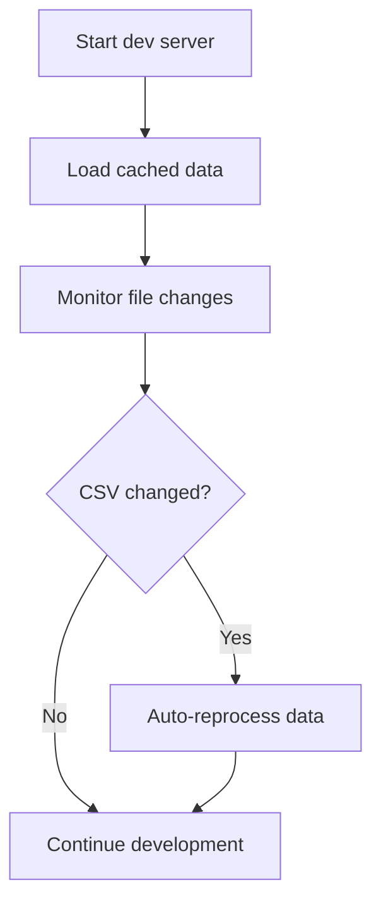
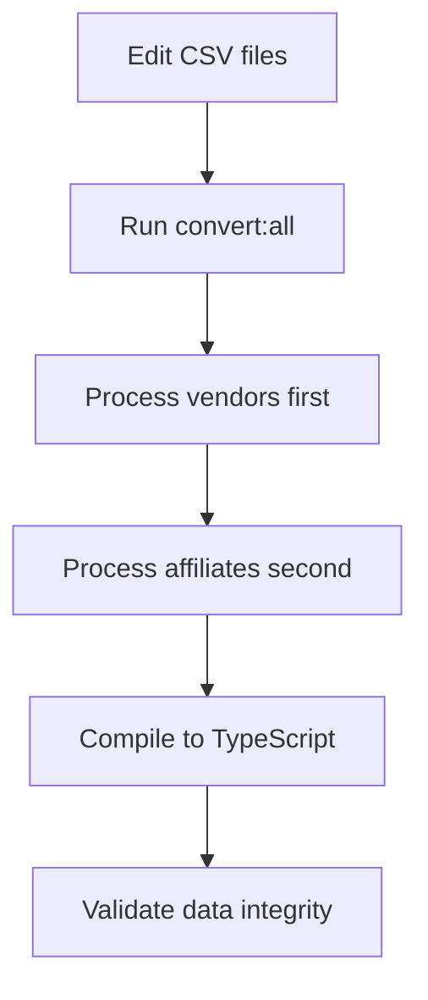
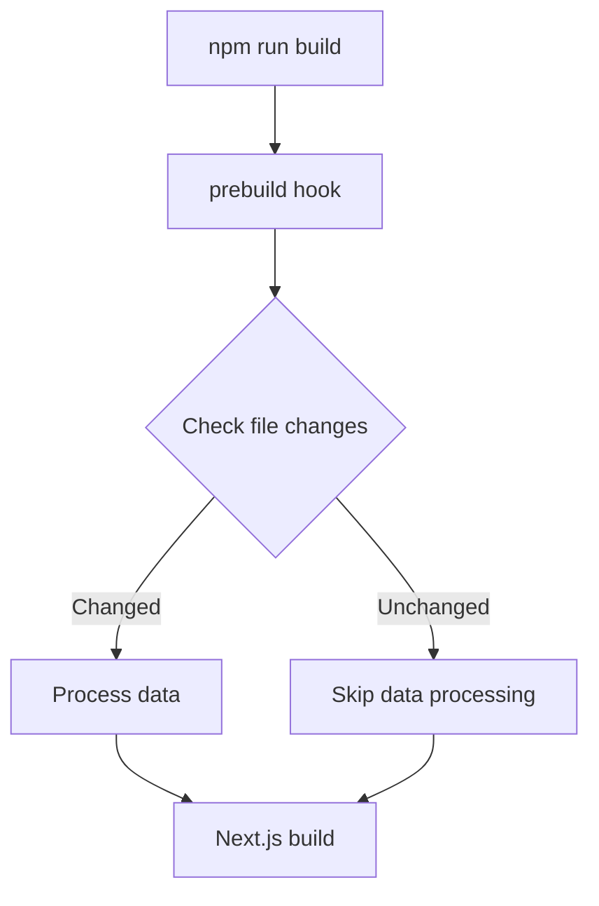
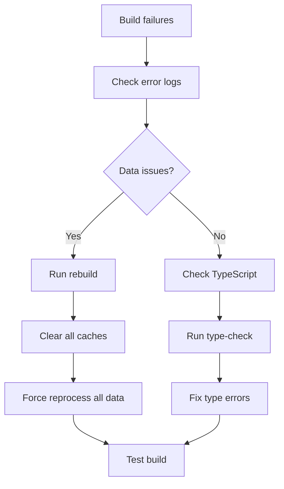

# Transcript Platform Commands

## 🚀 Quick Start Commands
| Command | Purpose | When to Use |
|---------|---------|-------------|
| `npm run dev` | Start development server | **Daily development** |
| `npm run build` | Production build | **Deployment** |

## 📊 Data Processing Commands
| Command | Purpose | When to Use |
|---------|---------|-------------|
| `npm run convert:vendors` | Convert vendor CSV → JSON | **Debug vendor data** |
| `npm run convert:affiliates` | Convert affiliate CSV → JSON | **Debug affiliate data** |
| `npm run convert:all` | Process all CSV data | **All data** |
| `npm run convert` | Same as all |

## 🔍 Data Validation Commands
| Command | Purpose | When to Use |
|---------|---------|-------------|
| `npm run validate:vendors` | Validate vendor data | **Check vendor data quality** |
| `npm run validate:affiliates` | Validate affiliate data | **Check affiliate data quality** |
| `npm run validate:all` | Validate all data | **Check all data** |
| `npm run validate` | Same as all |

### Data Compilation
| Command | Purpose | When to Use |
|---------|---------|-------------|
| `npm run compile:all` | Compile JSON → TypeScript |
| `npm run compile` | Same as all |

## 🏗️ Prebuild
| Command | Purpose | When to Use |
|---------|---------|-------------|
| `npm run prebuild` | Timely data processing | **Automatic before build** |

### Force Rebuild
| Command | Purpose | When to Use |
|---------|---------|-------------|
| `npm run rebuild` | Force rebuild everything | **Cache issues** |

## 🧪 Development & Testing Commands

| Command | Purpose | When to Use |
|---------|---------|-------------|
| `npm run type-check` | TypeScript validation | **Development, CI/CD** |
| `npm run start` | Production server | **Local testing, demos** |

## 📋 Command Hierarchy & Dependencies

### Data Processing Flow
```
CSV Files → convert:vendors → convert:affiliates → compile → TypeScript
     ↓              ↓              ↓              ↓
  Raw Data    Vendor JSON   Affiliate JSON   Compiled TS
```

### Validation Flow
```
Data Files → validate:vendors → validate:affiliates → All Validated
     ↓              ↓              ↓
  Compiled    Vendor Check   Affiliate Check   Ready to Use
```

### Build Flow
```
Source Code → prebuild → build → Production Ready
     ↓           ↓        ↓
  Changes    Smart Data   Next.js Build
```

## 🎯 When to Use Each Command

### Daily Development
```bash
# Start development (uses cached data)
npm run dev

# If you change CSV files, restart dev server
# It automatically detects changes
```

### Data Updates
```bash
# When you modify ANY CSV files
npm run convert:all

# This processes vendors and affiliates in order
# No need to run individual commands
```

### Quality Assurance
```bash
# Before committing code - validates both datasets in order
npm run validate:all
```

## 🔄 Automatic vs Manual Commands

### Automatic (Run by Other Scripts)
- `prebuild` → Runs automatically before `build`
- `convert`
- `compile`

### Manual (Developer Runs These)
- `dev` → Development server
- `build` → Production build
- `rebuild` → Force rebuild everything
- `validate` → Data quality checks
- `type-check` → TypeScript validation


## 🚨 Command Dependencies

### Critical Order
1. **Vendors must be processed before affiliates** (affiliates reference vendor data)
2. **Data must be compiled before validation** (validation needs compiled data)
3. **Data must be processed before build** (build needs compiled data)

### Automatic Enforcement
- `convert:all` enforces correct order
- `validate:all` enforces correct order
- `prebuild` enforces correct order

## 📊 Performance Comparison
| Command | Time | When to Use |
|---------|------|-------------|
| `convert:vendors` | ~2s | Debug vendor issues only |
| `convert:affiliates` | ~1s | Debug affiliate issues only |
| `convert:all` | ~3s | **Normal data updates** |
| `validate:all` | ~2s | **Quality checks** |
| `build` (with cache) | ~3s | **Normal builds** |
| `build` (without cache) | ~7s | **First build after changes** |
| `rebuild` | ~10s | **Major issues, debugging** |

## 🏗️ Processing Steps & Architecture

### Core Processing Steps
```typescript
interface ProcessingStep {
  name: string;                    // Step identifier
  sourcePattern: string;           // Input file pattern (glob)
  destinationPattern: string;      // Output file pattern (glob)
  processor: string;               // npm script to execute
  dependencies?: string[];         // Prerequisites
  validation?: string;             // Validation script
}
```

### Processing Pipeline
```typescript
const PROCESSING_PIPELINE: ProcessingStep[] = [
  {
    name: 'vendors',
    sourcePattern: 'data/vendors.csv',
    destinationPattern: 'data/vendors.json',
    processor: 'npm run convert:vendors',
    validation: 'npm run validate:vendors'
  },
  {
    name: 'affiliates',
    sourcePattern: 'data/affiliates.csv',
    destinationPattern: 'data/affiliates.json',
    processor: 'npm run convert:affiliates',
    dependencies: ['vendors'],
    validation: 'npm run validate:affiliates'
  },
  {
    name: 'compile',
    sourcePattern: 'data/*.json',
    destinationPattern: 'lib/data/*.ts',
    processor: 'npm run compile',
    dependencies: ['vendors', 'affiliates']
  }
];
```

### File Change Detection
```typescript
interface FileTimestamp {
  path: string;                    // File path
  mtime: number;                   // Last modification time
  size: number;                    // File size
  hash: string;                    // Content hash (MD5)
}

interface CacheData {
  dependencies: Map<string, FileDependency>;
  lastBuild: number;
  buildHash: string;               // Hash of all source files
  processingOrder: string[];       // Topological sort order
}
```

## 🔄 Use Cases & Flows

### Use Case 1: Daily Development


**Commands Used:**
- `npm run dev` (automatic data processing)

### Use Case 2: Data Updates


**Commands Used:**
- `npm run convert:all`
- `npm run validate:all`

### Use Case 3: Production Build


**Commands Used:**
- `npm run build` (automatic prebuild)

### Use Case 4: Troubleshooting


**Commands Used:**
- `npm run rebuild`
- `npm run type-check`

## 🎯 Design Decisions & Rationale

### 1. Command Naming Convention
**Decision:** Use `:all` suffix for combined operations
**Rationale:** 
- Clear distinction between individual and combined operations
- Follows npm script naming patterns
- Explicit about what will be processed

**Alternatives Considered:**
- `convert` (default = all) - Less explicit, could surprise developers
- `convert:combined` - Too verbose
- `convert:batch` - Less intuitive

### 2. Processing Order Enforcement
**Decision:** Hard-code dependencies in processing pipeline
**Rationale:**
- Prevents race conditions
- Ensures data integrity
- Clear dependency graph

**Alternatives Considered:**
- Dynamic dependency detection - Complex, error-prone
- Makefile-style rules - Platform-specific
- Manual coordination - Error-prone, requires developer knowledge

### 3. Cache Strategy
**Decision:** File timestamp + content hash + size checking
**Rationale:**
- Timestamps are fast and reliable
- Content hashes catch content-only changes
- File size catches truncation/corruption

**Alternatives Considered:**
- Timestamp only - Fast but less reliable
- Content hash only - Reliable but slower
- File watching - Real-time but complex

### 4. Error Handling
**Decision:** Fail-fast with clear error messages
**Rationale:**
- Prevents partial builds
- Clear debugging information
- Maintains data integrity

**Alternatives Considered:**
- Continue on error - Could lead to inconsistent state
- Retry logic - Adds complexity
- Graceful degradation - Could mask serious issues

## 🔐 Cache Coherency Options

### Option 1: Timestamp-Based (Current)
```typescript
// Check file modification times
function hasFileChanged(current: FileTimestamp[], cached: FileTimestamp[]): boolean {
  for (const currentFile of current) {
    const cachedFile = cached.find(c => c.path === currentFile.path);
    if (!cachedFile || cachedFile.mtime !== currentFile.mtime) {
      return true;
    }
  }
  return false;
}
```

**Pros:**
- ✅ Fast execution
- ✅ File system native
- ✅ Cross-platform compatible

**Cons:**
- ❌ Clock skew issues
- ❌ Touch command can fool it
- ❌ Doesn't detect content-only changes

### Option 2: Content Hash-Based
```typescript
// Check file content hashes
function hasContentChanged(current: FileTimestamp[], cached: FileTimestamp[]): boolean {
  for (const currentFile of current) {
    const cachedFile = cached.find(c => c.path === currentFile.path);
    if (!cachedFile || cachedFile.hash !== currentFile.hash) {
      return true;
    }
  }
  return false;
}
```

**Pros:**
- ✅ Detects all content changes
- ✅ Immune to clock issues
- ✅ Detects corruption

**Cons:**
- ❌ Slower execution
- ❌ Memory usage for large files
- ❌ Hash collision risk (theoretical)

### Option 3: Hybrid Approach
```typescript
// Check timestamp first, hash if timestamp changed
function hasFileChanged(current: FileTimestamp[], cached: FileTimestamp[]): boolean {
  // Quick timestamp check
  if (hasTimestampChanged(current, cached)) {
    // Detailed hash check
    return hasContentChanged(current, cached);
  }
  return false;
}
```

**Pros:**
- ✅ Best of both worlds
- ✅ Fast path for unchanged files
- ✅ Reliable change detection

**Cons:**
- ❌ More complex logic
- ❌ Still has hash computation overhead
- ❌ More code to maintain

### Option 4: Incremental Processing
```typescript
// Only process changed files
function getChangedFiles(current: FileTimestamp[], cached: FileTimestamp[]): string[] {
  const changed: string[] = [];
  for (const currentFile of current) {
    const cachedFile = cached.find(c => c.path === currentFile.path);
    if (!cachedFile || cachedFile.hash !== currentFile.hash) {
      changed.push(currentFile.path);
    }
  }
  return changed;
}
```

**Pros:**
- ✅ Minimal processing
- ✅ Fast execution
- ✅ Efficient resource usage

**Cons:**
- ❌ Complex dependency tracking
- ❌ Risk of inconsistent state
- ❌ Harder to debug

## ❓ Open Questions

### 1. Cache Invalidation Strategy
**Question:** How should we handle cache invalidation when dependencies change?
**Options:**
- Clear entire cache
- Clear only affected dependencies
- Incremental cache updates

**Current Approach:** Clear entire cache on any change
**Consideration:** More aggressive invalidation vs. performance

### 2. File Watching vs. Build-Time Checking
**Question:** Should we implement real-time file watching for development?
**Options:**
- Build-time only (current)
- Development-time watching
- Hybrid approach

**Current Approach:** Build-time checking only
**Consideration:** Developer experience vs. complexity

### 3. Cross-Platform Compatibility
**Question:** How do we ensure consistent behavior across platforms?
**Challenges:**
- File system differences
- Path separator variations
- Timestamp precision differences

**Current Approach:** Node.js built-ins
**Consideration:** Platform-specific optimizations

### 4. Cache Persistence
**Question:** Should cache persist across system restarts?
**Options:**
- Memory-only (current)
- File-based persistence
- Database storage

**Current Approach:** File-based persistence
**Consideration:** Performance vs. reliability

### 5. Dependency Resolution
**Question:** How should we handle circular dependencies?
**Current Approach:** Hard-coded order
**Consideration:** Dynamic dependency resolution


**Version**: 0.1  
**Date**: August 2025
**Copyright**: 2025 Transcript Developers
